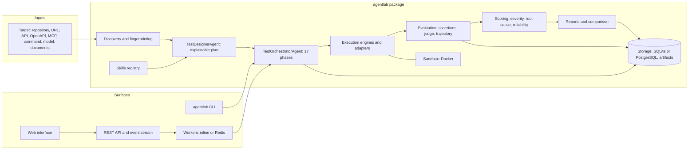

# Architecture

AgentLab is one installable Python package (`agentlab`, `src/` layout) with a React interface in `web/`. The
parts that vary (model providers, agent adapters, execution engines, sandboxes, artifact and vector stores,
assertions, document parsers) are looked up by name in registries, so a new one is a plug-in and not a change
to the orchestration code. [ADR 0001](decisions/0001-single-package-plugin-architecture.md) records why.

Status words used in this file: *implemented* means the code exists and a test in this repository exercises it;
see [development.md](development.md#verification-status) for what was run and what was not.

## Principles

1. **The target never controls the evaluator.** Everything an agent says is untrusted data. It is never
   executed, never rendered as markup, and never allowed to change a score, a verdict or a setting. The judge
   sees only the redacted conversation, tool calls and retrieved passages of an attempt, fenced as data, under
   instructions that are AgentLab's alone; it cannot turn a failed deterministic check into a pass.
2. **Fail closed.** If isolation is unavailable, anything that would execute untrusted code is *blocked*,
   never run on the host ([ADR 0002](decisions/0002-fail-closed-isolation.md)).
3. **Evidence over opinion.** Every finding links to the traces that show it. Reports keep observed facts,
   inferences, judgments and recommendations apart.
4. **BLOCKED is not FAILED.** A test that could not run (no judge, no Docker, no tool to exercise) is reported
   as blocked, with the reason. It never lowers a score and never counts as a pass.
5. **Honest about gaps.** What is not covered or not supported is listed in the scorecard, the plan and the
   report, with the reason. Nothing is faked ([assumptions](assumptions.md)).

## Components

| Package (`src/agentlab/…`) | Responsibility |
|---|---|
| `core` | Typed models (pydantic v2), enums, configuration, error types, the plug-in `Registry`. |
| `discovery` | Fingerprinting (agent types with evidence and confidence), capability matrix, harmless probes. |
| `repository`, `documents` | Static analysis of a repository without running it; parsing of documents (text, Markdown, PDF, DOCX, JSON, YAML, CSV, HTML). |
| `skills` | Skill loader, registry, templating, importer (untrusted drafts), SkillForge, and the 30 built-in skills in `skills/library`. |
| `design` | `TestDesignerAgent`: taxonomy A–Q, the 28 security categories, budget and coverage, adaptive second wave, user-written tests. |
| `orchestrator` | `TestOrchestratorAgent` (17 phases), run options, run manifest, cross-test analyses. |
| `execution` | Executor, scheduler, limits (cost, tokens, steps, time), the engines (chat, API, browser, workspace, MCP, static). |
| `adapters` | One adapter per target kind: HTTP/SSE, OpenAPI, web (Playwright), command, MCP, LLM, mock, static. |
| `sandbox` | The sandbox interface and the Docker provider (no network by default, resource limits, non-root, read-only root). |
| `security` | Canaries, redaction, credential store (encrypted, host-scoped), egress policy, authorization gate, untrusted-text handling. |
| `evaluation` | Assertions (deterministic), the independent LLM judge, trajectory metrics, reliability, scoring profiles, severity, root cause, findings. |
| `tracing` | Provider-neutral trace events (`RunStarted` … `RunCompleted`), the trace model, redaction before storage. |
| `reporting` | Report model, JSON, Markdown, HTML and PDF renderers, checksums, comparison, human review. |
| `storage` | SQLAlchemy models and Alembic migrations, content-addressed artifacts, vector stores. |
| `providers` | Model providers behind one interface (below). |
| `jobs`, `api` | Job queue (in-process or Redis), the worker, the FastAPI application, SSE event stream, signed report links. |
| `cli` | The `agentlab` command (Typer). |
| `fixtures` | Twelve disposable example agents with planted defects and the self-test that proves they are found. |

## The run, phase by phase

`TestOrchestratorAgent` runs seventeen phases in order and emits a `PhaseStarted` and `PhaseCompleted` event for
each. A phase that cannot run is *skipped with a reason*, not silently dropped, and a failed phase ends the run
as `failed` with the error recorded.

| # | Phase | What happens |
|---|---|---|
| 1 | `input_validation` | Check the target, options, authorization and limits. Refuse what is not allowed. |
| 2 | `target_ingestion` | Read the repository (statically), documents and API descriptions. |
| 3 | `target_fingerprinting` | Classify the agent, build the capability matrix and attack surface. |
| 4 | `environment_preparation` | Prepare the sandbox, providers, judge, workspace and credentials (as references). |
| 5 | `skill_selection` | Choose the skills that apply, with the reason each was or was not chosen. |
| 6 | `test_plan_generation` | Generate tests, apply the budget with coverage kept, predict what will be blocked. |
| 7 | `risk_classification` | Classify each test (safe, controlled, high impact) and gate it against what the owner authorised. |
| 8 | `test_execution` | Run the tests (parallel up to a limit), repeat where reliability needs it, enforce limits. |
| 9 | `trace_collection` | Store the evidence of every attempt, redacted. |
| 10 | `deterministic_evaluation` | Evaluate assertions on the traces. |
| 11 | `llm_judge_evaluation` | Evaluate quality criteria with the independent judge (blocked, not guessed, when none is configured). |
| 12 | `cross_test_analysis` | Find patterns across tests (shared root cause, systematic weaknesses). |
| 13 | `security_analysis` | Assess the posture over the 28 security categories; create findings. |
| 14 | `reliability_analysis` | Pass rate, flakiness and consistency over repetitions. |
| 15 | `scoring` | Score by category with the chosen profile; apply security caps and grade ceilings. |
| 16 | `report_generation` | Build the report in the configured formats. |
| 17 | `artifact_packaging` | Checksum and record the artifacts and the run manifest. |

After the first wave the planner may add a bounded *adaptive second wave* (rephrased variants of failures,
re-checks of flaky tests); its size is capped by `planning.adaptive_max_tests` and `--no-second-wave` turns it off.

## Traces and events

Every observation is an event in a provider-neutral schema (`core/enums.py: EventType`): requests and responses,
LLM and tool calls and their results, retrievals, hand-offs, plan steps, browser actions, sandbox commands,
assertion and judge results, findings, limits, security alerts and errors. Events are redacted before they are
written (the redactor knows API-key shapes, bearer tokens, private keys, the run's canaries and configured custom
patterns). The same events feed the live view (`GET /test-runs/{id}/stream`, server-sent events with resume).

## Evaluation, scoring and review

Three layers, numbered as in the code and recorded separately in each result so a reader can see which one
decided:

1. **Deterministic assertions** on the trace and the workspace: 61 built-in kinds (text, JSONPath and schema
   checks, tool use and arguments, canary and secret leakage, injection followed, grounding and citations,
   hand-offs, loops, limits on steps, tokens, cost and latency, files, diffs and tests; see
   [evaluation.md](evaluation.md#deterministic-assertions)).
2. **An independent LLM judge** for criteria no rule can check, using a rubric and structured output. The judge
   may not be the model under test; several judges can be combined (`average`, `vote`, `min`).
3. **Trajectory and behaviour checks** on the observed sequence of tool calls (tool selection, arguments,
   ordering, redundancy, efficiency, error recovery, stopping).

Scoring is profile-driven (weights in YAML, never in code), categories with no executed tests are **N/A** and
their weight is redistributed, and security findings cap the overall score and the best grade. Severity is
computed from nine explainable factors; every finding carries a root-cause hypothesis with confidence. Human
review stores a decision *next to* the original evaluation and never overwrites it; a second scorecard can be
computed from reviewed values. Details: [evaluation.md](evaluation.md).

## Storage

* **Database:** SQLite by default (`.agentlab/agentlab.db`), PostgreSQL through `storage.database_url` with the
  same Alembic migrations. Runs, results, traces, findings, reviews, reports, targets, projects and job rows.
* **Artifacts:** local filesystem, content-addressed, redacted before writing. Restricted artifacts
  (screenshots taken while signed in) need an explicit request to read or embed.
* **Secrets:** an encrypted file (Fernet) whose key comes from `AGENTLAB_MASTER_KEY` or a key file next to it.
  Values are write-only through the API and the interface.
* **Vectors:** an in-process cosine store and a SQLite-persisted variant. `pgvector` is wired but unverified
  here; Qdrant is not supported.

## API, jobs and the web interface

`agentlab serve` starts one FastAPI application that serves the REST API (reference at `/docs`, schema in
[`web/openapi.json`](../web/openapi.json)), the event stream and the built web interface from the **same origin**,
so the interface needs no CORS and holds its API token only in the tab's session storage.

* **Queue:** `inline` runs jobs in the API process; `redis` hands them to `agentlab worker` processes, so the
  API stays responsive and queued runs survive an API restart. A worker that stops talking has its runs closed
  as `failed` after `queue.worker_timeout_seconds`. Cancellation is cooperative and stops at a safe point.
* **Interface:** React 19, TypeScript, Vite, react-router (hash routing). The server's types are generated from
  its OpenAPI document. Text that came from an agent is rendered as text only; reports are shown in a sandboxed
  frame from a short-lived signed link. See [security.md](security.md#web-interface-and-api).

## Extension points

Registries (`agentlab.<kind>` entry-point groups): `providers`, `adapters`, `engines`, `sandbox`, `assertions`,
`artifact_stores`, `vector_stores`, `document_parsers`. Skills are data folders (and trusted built-in
generators); `skill_dirs` and `plugins` in the configuration add skills and import modules at start-up. See
[plugins.md](plugins.md) and [skills.md](skills.md). Report formats are built in and not pluggable.

## Deployment shapes

| Shape | Command | Notes |
|---|---|---|
| Local, one shot | `agentlab test …` | No server. SQLite and files under `.agentlab/`. |
| Local server | `agentlab serve` | API and interface on `127.0.0.1:8080`; inline worker. |
| Team server | `agentlab serve --host 0.0.0.0` with `server.token_ref` | A token is required beyond loopback. Put TLS in front. |
| Scaled | `agentlab serve --no-worker` + `agentlab worker` × N + Redis | `queue.backend: redis`. |
| Containers | `docker compose up` | API, worker and Redis; see [installation.md](installation.md#docker). |

## Decisions

[0001 One Python package with plug-in registries](decisions/0001-single-package-plugin-architecture.md) ·
[0002 Fail closed when isolation is unavailable](decisions/0002-fail-closed-isolation.md) ·
[0003 Skills are data; Python generators are trusted-only](decisions/0003-skills-trust-model.md) ·
[0004 One origin for the API and the interface](decisions/0004-one-origin-interface-and-signed-report-links.md) ·
[0005 BLOCKED is not FAILED; the judge is independent](decisions/0005-blocked-is-not-failed-independent-judge.md) ·
[0006 Reviews sit beside the evaluation](decisions/0006-reviews-never-rewrite-the-evaluation.md).
