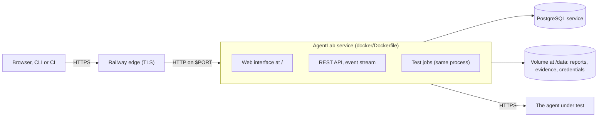

# Deploying on Railway

AgentLab runs on [Railway](https://railway.com) as **one service built from this repository's Dockerfile**. That one
container serves the REST API, the web interface (the React application is compiled into the image) and the test jobs,
so there is no separate front-end service, no CORS to configure and no API address to give the interface: it calls the
origin it was loaded from ([ADR 0004](decisions/0004-one-origin-interface-and-signed-report-links.md)). A PostgreSQL
service keeps the data and a volume keeps the files.

Read [What was verified, and what was not](#what-was-verified-and-what-was-not) before you rely on this. The files were
exercised locally against a container started the way Railway documents starting one; **nothing here has been deployed
on Railway itself**, because no Railway account was available.

* [What is in the repository](#what-is-in-the-repository)
* [Deploy](#deploy)
* [Variables](#variables)
* [Adding a model provider](#adding-a-model-provider)
* [What does not work on Railway](#what-does-not-work-on-railway)
* [Running it](#running-it)
* [Security](#security)
* [What was verified, and what was not](#what-was-verified-and-what-was-not)
* [Troubleshooting](#troubleshooting)



## What is in the repository

| File | What it does |
|---|---|
| [`railway.json`](../railway.json) | Railway's config as code: build with `docker/Dockerfile`, start with the script below, health check at `/health`, one instance, 30 seconds to stop. |
| [`docker/Dockerfile`](../docker/Dockerfile) | Builds the web interface in a Node stage and installs AgentLab with the interface inside it. It has **no `VOLUME` instruction**, because Railway's builder refuses one ("The VOLUME keyword is banned in Dockerfiles. Use Railway volumes instead."). |
| [`docker/railway-start.sh`](../docker/railway-start.sh) | The start command: listens on the `PORT` Railway injects, uses the configuration below, and deals with the volume (see [Variables](#variables)). |
| [`docker/agentlab.railway.yaml`](../docker/agentlab.railway.yaml) | AgentLab's configuration for one service: jobs run in the API process, files live under `/data`, an API token is required, targets on private networks are refused. |

Railway documents that a custom start command replaces the image's `ENTRYPOINT` and runs without a shell, so
`$PORT` would not be expanded in it. That is why the start command is a script and not a command line.

## Deploy

1. **Create the project.** In Railway choose *New Project → Deploy from GitHub repo* and select this repository (or your
   fork: you need a fork to change [the configuration](#adding-a-model-provider)). Railway reads `railway.json`. The
   first build takes a few minutes, because it builds the interface and installs the package.
2. **Add PostgreSQL.** *New → Database → Add PostgreSQL*. Without it AgentLab keeps a SQLite file on the volume, which
   is fine for trying it out and not for data you want to keep.
3. **Set the variables** of the AgentLab service ([table below](#variables)). At least `AGENTLAB_API_TOKEN`
   and `RAILWAY_RUN_UID`. A first deployment without the token fails on purpose and says why in its log, because the
   server listens on every interface and never starts open.
4. **Add a volume** to the AgentLab service with the mount path `/data`. Everything AgentLab writes (reports,
   evidence, uploads, the credential store) is under `/data`; the root file system is not kept between deployments.
5. **Generate a domain**: the service's *Settings → Networking → Public Networking → Generate Domain*. AgentLab listens on
   the port Railway injects, so the domain reaches it.
6. **Open the domain and sign in** with the token. `GET /health` answers without it. The *Settings* screen (and
   `GET /environment`) shows the checks `agentlab doctor` makes: the database, the writable folders, which providers
   are configured and, with two warnings that are expected here, that there is no Docker and no browser
   ([below](#what-does-not-work-on-railway)).

## Variables

Set these on the AgentLab service. Nothing secret is written into a file of the repository.

| Variable | | Value |
|---|---|---|
| `AGENTLAB_API_TOKEN` | **required** | A secret of 16 or more characters that every request must present: `openssl rand -hex 24`. The web interface asks for it when it opens. The server refuses to start without it. |
| `RAILWAY_RUN_UID` | **required** with the volume | `0`. Railway mounts a volume owned by root, and Railway documents this variable as the remedy for an image that runs as another user. It makes the container *start* as root; `docker/railway-start.sh` then gives `/data` to AgentLab's own user (uid 10001) and runs AgentLab as that user with `no_new_privs`, so no root process ever serves a request. Without it AgentLab stops at once and says so. |
| `AGENTLAB_DATABASE_URL` | recommended | `${{Postgres.DATABASE_URL}}`, a Railway reference to the database service (use the name your PostgreSQL service has). A `postgres://` or `postgresql://` URL is understood; AgentLab opens it with its own driver. Without it, SQLite on the volume. |
| `AGENTLAB_MASTER_KEY` | recommended | The key that encrypts credentials stored in AgentLab: `openssl rand -base64 32 \| tr '+/' '-_'`. Without it the key is a file on the volume, next to the credentials it protects. Keep a copy: credentials cannot be read without it. |
| a key per model provider | as needed | For example `OPENAI_API_KEY`, referenced from the configuration as `env:OPENAI_API_KEY`. |
| `PORT` | do not set | Railway injects it and the health check uses it. |

## Adding a model provider

`docker/agentlab.railway.yaml` configures only the built-in `mock` provider, which needs nothing and cannot judge. To test
with a model, or to have one judge subjective criteria, change the file in your fork and push; Railway redeploys. Keys
stay in variables and are referenced by name ([providers.md](providers.md)):

```yaml
providers:
  - name: openai
    type: openai
    model: <a model your key can use>
    api_key_ref: env:OPENAI_API_KEY

evaluation:
  judges:
    - {provider: openai}
```

The same file holds the run limits (`limits.max_cost_usd`, tokens, steps and time; [configuration.md](configuration.md#limits)).
They are what bounds the spend on a model; set them to what you are willing to pay.

## What does not work on Railway

AgentLab says so in a run instead of pretending, and a test that cannot run is **BLOCKED** with the reason, never failed.

* **Tests that execute untrusted code are blocked.** Repositories, coding agents and MCP servers that AgentLab starts from
  a command run only inside a Docker sandbox, and there is no Docker on Railway (and the Docker socket is never
  mounted). Targets that are reachable over HTTP, such as an agent with an API, a chat page or an OpenAPI description,
  are tested as usual. To test a repository, run AgentLab where Docker is available.
* **Browser tests are blocked.** The image contains no Chromium. The interface and the API do not need one.
* **One instance, with the jobs inside it.** A volume belongs to one service and Railway does not allow replicas on a
  service with a volume, so the API cannot hand work to a separate worker service that would have to write the same
  reports and evidence. The queue is `inline`. Do not raise `numReplicas`.
* **Targets must be reachable from Railway.** A public HTTPS address works. Addresses on a private network (another
  service of the project over Railway's private network, `localhost`) are refused by `security.allow_private_networks:
  false`; see [Security](#security) before you change it.
* **No object storage.** Evidence is kept on the volume; `storage.artifact_store: s3` is [not implemented](plugins.md#artifact-stores).

## Running it

* **A deployment interrupts runs.** Railway replaces the instance, and it documents a short outage for a service with a
  volume. A run that is going when Railway sends the stop signal is asked to stop at a safe point and ends as
  `cancelled` with the reason "the worker is stopping"; what already ran is analysed and reported
  ([tested](../tests/integration/test_cli_serve.py)). `railway.json` asks Railway for 30 seconds before it kills the
  process (`drainingSeconds`). A run that is killed regardless is closed as failed after
  `queue.worker_timeout_seconds`. Start long runs when you do not expect to deploy.
* **Back up both stores.** The database (PostgreSQL) holds runs, results, traces and findings; the volume holds reports,
  evidence and credentials. Use the backup features Railway offers for each. Take a backup before an upgrade: AgentLab
  migrates the database when it starts, and a migration is not undone by redeploying an older version.
* **Logs** are the deployment's log in Railway. AgentLab masks tokens and keys before it writes a line.
* **Upgrading** is a deployment of a newer commit. `agentlab doctor` shows the schema version it expects.

## Security

The server is on the public internet, so read [security.md](security.md#web-interface-and-api) as well.

* **The token is the only authentication.** There are no accounts and no roles. Whoever holds it can start runs that
  send requests from Railway's network, read every report and store credentials. Use the generated value, keep it in a
  Railway sealed variable if you can, and change it (variable, then redeploy) when someone leaves. Failed attempts are
  slowed down.
* **TLS is Railway's.** AgentLab speaks plain HTTP behind Railway's edge and has no TLS of its own; reach it only
  through the generated or a custom domain.
* **No root process serves requests**, the process cannot gain privileges, and the image has no Docker client. The
  files the server writes belong to an unprivileged user.
* **The configuration refuses private networks.** A token holder could otherwise point a target at an address only
  your Railway project can reach, such as a database. Set `security.allow_private_networks: true` in your fork's
  `docker/agentlab.railway.yaml` only if you mean to test a service over the private network, and understand that the
  token then reaches everything on it. Cloud metadata addresses stay blocked either way.
* **Nothing secret is stored in the repository or the image.** `GET /settings` shows references (`env:NAME`) and
  connection strings with the password masked.

## What was verified, and what was not

Verified here, with the commands and the outcome in the pull request that added this page:

| What | How | Result |
|---|---|---|
| `railway.json` is valid | checked against Railway's published JSON schema (`railway.com/railway.schema.json`, fetched 2026-10-07) | no errors |
| The files agree with each other and with the code | [`tests/integration/test_deploy_files.py`](../tests/integration/test_deploy_files.py): the start script (port, arguments, ownership, dropping root, the message when the volume is not writable), `railway.json` against the Dockerfile, no `VOLUME`, the configuration against `AgentLabConfig`, `/health` answered with Railway's `Host` and no token | passes |
| A `postgres://` or `postgresql://` URL opens with the installed driver | [`tests/unit/test_storage.py`](../tests/unit/test_storage.py) | passes |
| A server stopped with `SIGTERM` in the middle of a run winds the run down and still reports it | [`tests/integration/test_cli_serve.py`](../tests/integration/test_cli_serve.py), a real `agentlab serve` process | passes |
| The image builds from `docker/Dockerfile` | `docker build` (in the environment this was developed in, with its TLS certificate authority added) | builds |
| The container behaves as described, started as Railway starts one | the image run with `--user 0:0`, a root-owned folder for `/data`, `PORT` set, a token and the start script as the entrypoint: health with `Host: healthcheck.railway.app`, the interface and its script served, `401` without or with a wrong token, the process owned by uid 10001 with `NoNewPrivs`, a run through the API completed, its reports written under `/data`, the data still there in a new container, `SIGTERM` ending the server with status 0, and a clear stop without the token or without `RAILWAY_RUN_UID` | all checks pass |
| PostgreSQL | the same container against a PostgreSQL 16 container with a `postgresql://` URL: schema created, a run stored as rows, the password masked in `/settings`, `agentlab doctor` reaching the database | all checks pass |

**Not verified, because it needs Railway itself:**

* that Railway's builder builds this Dockerfile (it needs BuildKit for `COPY --chmod`; the missing `VOLUME` line was
  made to match Railway's published error message, not tested against the builder);
* that Railway runs the start command as documented and starts the container as root with `RAILWAY_RUN_UID=0`;
* that a Railway volume behaves like the root-owned folder used here, including how long a redeployment takes;
* Railway's health check (host name, retries), its injected `PORT` and the domain's routing to it;
* the event stream (server-sent events) through Railway's proxy, including any limit on how long one request may last
  (the interface reconnects and resumes, which is tested without a proxy);
* Railway's private network and its PostgreSQL service (the checks used a local container and a Docker network);
* Railway's backups, costs and limits.

If any of these differs from the above, the file to change is `railway.json`, `docker/railway-start.sh` or the Dockerfile,
and the behaviour is covered by the tests named above.

## Troubleshooting

| What you see | Likely cause and what to do |
|---|---|
| Deploy log: `server.token_ref is env:AGENTLAB_API_TOKEN, but the variable AGENTLAB_API_TOKEN is not set or is empty` | The token variable is missing. Set it and redeploy. |
| Deploy log: `/data cannot be written by user 10001 ... RAILWAY_RUN_UID=0` | Set `RAILWAY_RUN_UID=0` on the service, or remove the volume. |
| Build log: `The VOLUME keyword is banned in Dockerfiles` | A `VOLUME` line was added to the Dockerfile. Remove it; Railway volumes are attached in its dashboard. |
| The deployment never becomes active | Read the deploy log for the start-up error. The health check waits for `/health`; the first start migrates the database and can take longer on a slow one, so raise `healthcheckTimeout` in `railway.json` if the log shows it was still migrating. |
| `psycopg.OperationalError` or `connection refused` | The database URL is wrong or the database is not up. Use the reference `${{Postgres.DATABASE_URL}}` with your service's name and check the database service is running. |
| The domain answers `502` | The domain's target port is not the port the service listens on (`PORT`). Do not set `PORT` yourself; if you set a target port by hand, make it the injected one. |
| The interface asks for the token again and again | The value typed differs from the variable (a trailing space is the usual cause). |
| Tests are reported BLOCKED: Docker or browser unavailable | Expected on Railway ([above](#what-does-not-work-on-railway)). |
