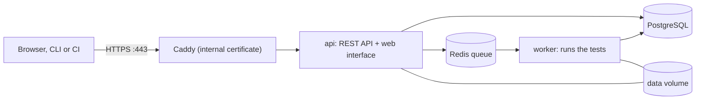

# Deploying on a single VPS (no domain)

AgentLab runs on one Linux server with Docker as the full Compose stack ([`docker/compose.yaml`](../docker/compose.yaml):
API with the web interface, worker, Redis, PostgreSQL) plus [`docker/compose.vps.yaml`](../docker/compose.vps.yaml), which
adds Caddy for TLS and stops publishing the API directly. It was set up on a Hostinger KVM 1 VPS (1 vCPU, 4 GB RAM,
Ubuntu 24.04). The decision is [ADR 0008](decisions/0008-vps-compose-with-caddy.md); the plan it followed is
[plan-vps-deployment.md](development/plan-vps-deployment.md).



## Set up

```bash
mkdir -p /root/agentlab && umask 077
printf 'AGENTLAB_API_TOKEN=%s\nAGENTLAB_DB_PASSWORD=%s\nAGENTLAB_PUBLIC_HOST=%s\n' \
  "$(openssl rand -hex 24)" "$(openssl rand -hex 24)" "<the server's IP address>" > /root/agentlab/.env
git clone https://github.com/AhmedSadek60/TestingAgent && cd TestingAgent
docker compose -f docker/compose.yaml -f docker/compose.vps.yaml --env-file /root/agentlab/.env up -d --build
```

The env file stays outside the repository, mode `0600`. Open `https://<the IP>`, accept the certificate warning (see
below) and sign in with `AGENTLAB_API_TOKEN`.

* **No domain, so a self-made certificate.** Caddy signs the certificate for the IP itself (`tls internal`), so browsers
  warn. The token is encrypted on the wire either way. With a domain, put it in `docker/Caddyfile` in place of
  `{$AGENTLAB_PUBLIC_HOST}`, remove `tls internal`, point DNS at the server and open port 80 for the certificate check.
* **A client that connects to an IP sends no server name.** `default_sni` in the Caddyfile names the certificate to
  offer; without it the handshake fails with `tlsv1 alert internal error`.
* **Firewall.** Accept only 22 and 443 (Hostinger firewall group `agentlab`; Docker publishes only 443 as well).
  Both are open to every address, so the token is the only authentication ([security.md](security.md#web-interface-and-api)).
  Limit the rules to your own address when you can.
* **Models.** Only the offline `mock` provider is configured. Add yours in a configuration file mounted over
  `/etc/agentlab/agentlab.yaml`, with its key as a variable in the env file (`api_key_ref: env:NAME`).
* **Backups.** `/root/agentlab/backup.sh` (cron, 03:17) writes a database dump and an archive of the `data` volume to
  `/root/agentlab/backups` and keeps seven of each. They are on the same disk; copy them elsewhere.
* **Upgrading:** `git pull`, then the `up -d --build` command again. Take a backup first; migrations are not undone by
  an older image. `docker compose down -v` deletes the data: do not use `-v`.

## The local model

The judge is a local model served by Ollama (`ollama/ollama:0.40.2`, limited to 1.5 GB of memory, no public port),
configured in [`docker/agentlab.vps.yaml`](../docker/agentlab.vps.yaml). The server has 1 CPU core, no GPU and 3.9 GB of
memory, so the choice was made by size:

| Candidate | Download | Fits? |
|---|---|---|
| `gemma4:e2b` (smallest Gemma 4) | 4.6 GB | no: more than the server's memory |
| `gemma3:4b` | 3.3 GB | no: with the other containers about 2.4 GB is free |
| `gemma3:1b` | 0.8 GB | yes. Chosen. About 19 tokens per second here |

Ollama rather than llama.cpp, because AgentLab's Ollama adapter was verified against a live Ollama server and the
llama.cpp adapter only against a stand-in ([providers.md](providers.md)). A 1B model is a weak judge: expect coarse
verdicts and some judge errors, and move to a larger model when the server has the memory (change `model`, then
`docker compose exec ollama ollama pull <model>`). A 2 GB swap file (`/swapfile`) stops a spike from killing a container.

## The host command line

Tests that run a repository's code need Docker, which the containers do not have. The command line is installed on the host as
well, in `/opt/agentlab-host`, with Chromium in `/opt/playwright`:

```bash
agentlab-host doctor
agentlab-host test --repo https://github.com/<you>/<repo>.git --command "<how the agent starts>"
```

`agentlab-host` (`/usr/local/bin`) uses `/root/agentlab/agentlab.host.yaml` and **shares the web interface's database and
files**, so its runs appear in the dashboard:

* the database is the stack's PostgreSQL, published on the server's loopback (`127.0.0.1:5432`) only; the wrapper builds
  the URL from `/root/agentlab/.env`;
* `/data` on the host is a symbolic link to the `agentlab_data` Docker volume, which the containers mount at `/data`, so
  paths stored in the database mean the same thing on both sides;
* the host command runs as root and the containers as uid 10001, so the wrapper gives `/data` to uid 10001 after each
  command; without that the API cannot read the evidence and the report downloads fail with HTTP 500;
* stored credentials stay on the host (`/var/lib/agentlab-host`): the web containers cannot use them.

Repository code runs only inside Docker sandboxes (no network, read-only file system, non-root, limited), never on the
host; the Docker socket is still not given to any container. A sandbox has no network, so an agent that downloads models or packages at start-up cannot run in one.

## What the web containers can and cannot do

**Browser tests work from the dashboard.** The image is built with Chromium (`WITH_BROWSER=1`, set in `docker/compose.vps.yaml`),
so a run started with the dashboard's Run button on a web target is driven by the worker's own Chromium. Chromium keeps its
**own sandbox**, which needs user namespaces, and Docker's default seccomp profile blocks them. The worker therefore runs with
[`docker/seccomp-chromium.json`](../docker/seccomp-chromium.json): Docker's default profile (from `moby/profiles`) with its
restrictions on `clone`, `clone3`, `unshare` and `setns` removed. It stays non-root (uid 10001) with every capability dropped,
a read-only root file system and `no-new-privileges`; it also gets `shm_size: 1gb` and `HOME=/tmp` (Chromium writes its
crash-report database there). The cost is that the worker allows unprivileged user namespaces, a wider kernel attack surface
([ADR 0009](decisions/0009-chromium-in-the-worker-with-a-userns-seccomp-profile.md)).

**Docker tests do not.** The image has no Docker client and the Docker socket is never mounted
([ADR 0002](decisions/0002-fail-closed-isolation.md)), so a run from the dashboard reports tests that run a repository, a coding
agent or an MCP server from a command as BLOCKED with the reason. Use [the host command line](#the-host-command-line) for those.

## What was verified, and what was not

Run on the server on 2026-10-08:

| What | Result |
|---|---|
| `docker compose ... config` | valid |
| Five containers started; `api`, `postgres`, `redis` healthy | yes |
| `/health` over HTTPS (`curl -k`) | 200 |
| `/projects` with no token, a wrong token, the right token | 401, 401, 200 |
| Web interface at `/` | 200 |
| `agentlab doctor` in the stack | database, Redis, folders, key, 30 skills ok; Docker sandbox and browser warn (blocked, as above) |
| `agentlab test --mock success --intensity quick` | completed, four report formats written under `/data/reports`, exit 1 because of the planted defects |
| `docker compose restart` | all services back, token accepted, the run still listed |
| Port 8080 on the host | not published |
| Hostinger firewall `agentlab` (22, 443) attached and synced | `is_synced: true` |
| Backup script run once | database dump and data archive written |

**Not verified:** access from outside this server (the checks ran from the server itself, so they do not prove the
firewall or the public route); a reboot of the server; the browser's view of the certificate; the cron run at 03:17;
restoring a backup; memory use under a real run (a 4 GB server runs five containers).
